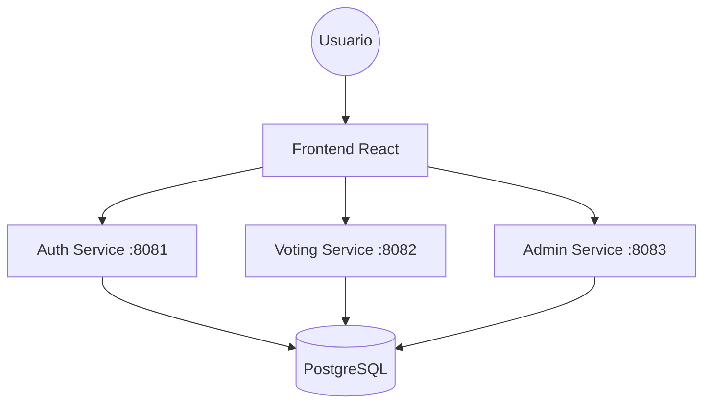

# Sistema de Votación Electrónica Distribuido

Este proyecto implementa un sistema de votación basado en microservicios, diseñado para ser escalable y resistente.

## Arquitectura del Sistema

El sistema sigue un patrón de **Microservicios** para separar las responsabilidades críticas:



### Componentes:
1.  **Auth Service:** Maneja el registro, login y generación de tokens JWT. Es la puerta de seguridad.
2.  **Voting Service:** Gestiona la emisión de votos. Implementa la restricción de "un voto por usuario" mediante restricciones de base de datos (`UNIQUE constraint`).
3.  **Admin Service:** Permite la gestión de candidatos y la visualización de resultados en tiempo real.
4.  **Database (PostgreSQL):** Persistencia centralizada con esquemas separados para integridad de datos.

## Cómo ejecutar el avance (DevOps)

Para levantar todo el sistema, solo necesitas ejecutar:

```bash
docker-compose up --build
```
Esto hará lo siguiente:
1.  Levantará una base de datos PostgreSQL.
2.  Ejecutará el script `init.sql` para crear las tablas automáticamente.
3.  Compilará y levantará los 3 servicios de Backend.
4.  Levantará el servidor de desarrollo de React.

## Servicios y ubicacion

| Servicio | URL | Verificar con |
|---|---|---|
| Auth Service | `http://localhost:8081/health` | `curl localhost:8081/health` |
| Voting Service | `http://localhost:8082/health` | `curl localhost:8082/health` |
| Admin Service | `http://localhost:8083/health` | `curl localhost:8083/health` |
| Frontend | `http://localhost:5173` | Abrir en el navegador |
| PostgreSQL | `localhost:5432` | `docker exec -it voting-db psql -U user_admin -d voting_system` |

Cada integrante debe verificar que su servicio responde correctamente antes de integrar cambios.

## Decisiones Técnicas
- **Separación de Servicios:** Permite que si el servicio de resultados (Admin) falla, el proceso de votación siga funcionando.
- **Dockerización:** Garantiza que el proyecto funcione igual en la computadora de cualquier integrante y en el servidor final.
- **Restricción de Concurrencia:** Se utiliza el nivel de aislamiento de transacciones de la base de datos para evitar votos duplicados si dos peticiones llegan al mismo tiempo.
